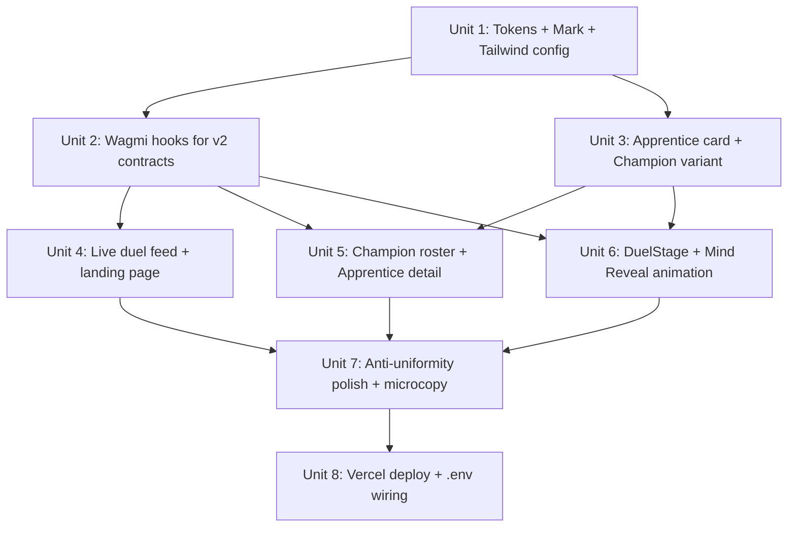

# feat: Orichalcos v2 Frontend — DuelStage + Mind Reveal demo path

## Overview

Build the demo-path frontend for Orichalcos v2 against the deployed Galileo testnet contracts. Tier 1 (contracts) and Tier 2 (autonomous agent runner with real TEE attestation) are already passing; this plan executes Tier 3.

The submission deadline is **May 16, 2026** — six calendar days from today. The hackathon judging criteria reward "Technical Integration Depth" (4-of-5 0G components, working end-to-end) far more than feature completeness. **Ruthlessly scoping** to the demo path is the explicit strategy: ship a polished landing → DuelStage → Mind Reveal flow rather than a half-broken full app.

## Problem Frame

The deployed contracts work. The autonomous agent produces TEE-attested duels with sealed souls, content-addressed public tells, and on-chain Title progression. There is currently **no UI** to expose this to a hackathon judge in the time they will spend on a single submission (1-2 minutes for a video, 3-5 minutes for the live link).

The judge needs to:
1. See in 15 seconds what Orichalcos is and why it matters
2. Watch a Scrying Duel resolve, with the Mind Reveal animation as the climactic moment that visually communicates "TEE attestation + 0G Storage hash + Pyth proof"
3. Understand the audit trail (the Codex) without reading code

Everything else (mint flow, marketplace, about page, full Codex pagination, account features) is cuttable.

The existing `dashboard/` directory is the v1 trading-vault UI with a different aesthetic (amber on dark vs brass on navy) and an obsolete data model (vault trades vs duels). It contains useful scaffolding (RainbowKit + wagmi + viem already wired, Next.js 14 app router, Tailwind v4) but the visual identity and content layer must be replaced.

## Requirements Trace

- **R1.** Landing page (`/`) communicates the project thesis above the fold and shows a live duel feed below it (per `docs/USER_FLOW.md` Flow 1.1).
- **R2.** A DuelStage page (`/trials/[duelId]`) renders a single duel, plays the Mind Reveal animation when the user clicks "Replay Mind Reveal", and shows the three wax seals (TEE / 0G / Pyth) with chainscan-galileo links per `docs/USER_FLOW.md` Flow 1.2.
- **R3.** Champion roster (`/trials/champions` or equivalent) shows all four Champion cards with current ELO, W/L, Title (per `docs/USER_FLOW.md` Flow 3.2 modal embedded as a page).
- **R4.** All on-chain reads (Apprentice data, duel state, Codex history) come from wagmi against the v2 contracts in `deployments-v2.json` — no backend API.
- **R5.** Visual identity follows `docs/DESIGN_SYSTEM.md` for colors, typography, and the Mind Reveal animation. Cipher Amber (`#ffb547`) appears ONLY during Mind Reveal.
- **R6.** The Mark sigil (Quincunx) ships in three sizes (large/medium/small) with the rough geometric SVG starter from `DESIGN_SYSTEM.md` §4.
- **R7.** Wallet connection via RainbowKit on 0G Galileo (existing `dashboard/src/lib/wagmi.ts` already configures the chain).
- **R8.** Frontend deployable to Vercel under `orichalcos.xyz` (HANDOFF.md Day 7).

## Scope Boundaries

### In scope (demo path)

- Landing page with hero, statistics wall, live duel feed, "How it works" mini section, footer
- Single Duel detail page with Mind Reveal modal triggered on click
- Champion roster page (4 cards)
- Apprentice/Champion detail page (one route, one canonical version) — needed because the duel feed and Champion roster cards link into it
- Mark sigil SVGs (large/medium/small)
- Three wax seal SVGs (TEE / 0G / Pyth) — Mind Reveal hero asset
- Wagmi hooks for `getData(tokenId)`, `getDuel(duelId)`, `championOf(type)`, `nextDuelId`
- Event subscription for `DuelSettled` to update the live feed
- Vellum texture overlay (single CSS rule, dramatic effect, advisor-recommended anti-uniformity rule)
- Per-Type hover signatures on Apprentice cards (advisor-recommended, character-defining)
- Mark sigil "breath" pause on rotation (advisor-recommended)
- The four locked microcopy replacements from `DESIGN_SYSTEM.md` §9.5.10 ("Bind Trainer", "Begin a Trial", "Decrypting...", "The seal did not hold")

### Explicit non-goals (advisor-recommended cuts, confirmed)

- ❌ `/apprentices/mint` — mint flow. Demo doesn't mint; Champions are pre-minted.
- ❌ `/apprentices` — full browse page. Champion roster covers this.
- ❌ `/marketplace` — entire marketplace flow (MVP-A cut order in HANDOFF §7).
- ❌ `/about` — README does this.
- ❌ `/codex` — full paginated feed. Live duel feed on landing page covers the audit-trail proof.
- ❌ Aksara Jawa / Devanagari script on Champion cards (`DESIGN_SYSTEM.md` §9.5.5) — verifying scripts is a Day 7 polish task that loses to demo recording.
- ❌ Drop-cap with `smcp` first letter (`DESIGN_SYSTEM.md` §9.5.3) — eats hours, judges won't notice.
- ❌ feTurbulence orb edge wobble (`DESIGN_SYSTEM.md` §9.5.4) — eats hours, judges won't notice.
- ❌ Card rotation randomization (`DESIGN_SYSTEM.md` §9.5.1) — only matters on a multi-card browse page, which we cut.
- ❌ Real Pyth feed integration in frontend — MockPyth only on testnet; on-chain reads are sufficient.
- ❌ Mobile responsive past basic flex/grid behavior — desktop demo only per `USER_FLOW.md` §10.
- ❌ Internationalization, light mode, accessibility beyond contrast/focus.
- ❌ Unit tests for React components — visual verification via the dev server is the primary check; integration verification is the live demo. Tests would add hours without judge-visible payoff.

### Locked anti-uniformity rules (3 of 12 from `DESIGN_SYSTEM.md` §9.5)

Per advisor recommendation, ship only the rules that have outsized effect-to-effort ratio:

1. **Vellum texture overlay** (§9.5.6) — single CSS rule, app-wide visual material upgrade.
2. **Per-Type hover signatures** (§9.5.9) — Bold lift+tilt, Patient descend, Sharp flicker, Stoic ring. Defines character.
3. **Mark sigil breath** (§9.5.11) — pause every fourth rotation. Subliminal, hardest to attribute, easiest to ship.

## Context & Research

### Relevant Code and Patterns

- `dashboard/src/lib/wagmi.ts` — existing RainbowKit + viem chain config for 0G Galileo (chainId 16602). **Reuse as-is.**
- `dashboard/src/app/providers.tsx` — RainbowKitProvider + WagmiProvider + QueryClient wrapping. **Reuse as-is.**
- `dashboard/src/lib/contracts.ts` — pattern for ABI + address constants. **Replace contents with v2 ABIs**, keep file shape.
- `dashboard/src/app/page.tsx` — existing v1 landing page (~18 KB). Read for Tailwind patterns and component shape, then replace.
- `dashboard/src/app/globals.css` — existing CSS-variable + Tailwind v4 setup with custom palette. **Pattern is right; tokens are wrong** — replace amber/dark with brass/navy per `DESIGN_SYSTEM.md` §2.
- `agent/data/champions.json` — Champion roster source of truth (name, type, tokenId, sealedSoulRoot, symmetricKey). Frontend needs `name`, `type`, `tokenId` — never the symmetric key.
- `agent/data/duels/duel-N.json` — duel records produced by `run-champion-duel.ts`. Includes public tells, TEE chatIds, tx hashes. Useful as a dev fallback before wagmi event-watching is wired.
- `deployments-v2.json` — canonical contract addresses for `.env.local`.

### Institutional Learnings

- `dashboard/src/app/page.tsx` v1 demonstrates that custom-theme + Tailwind v4 + RainbowKit composes cleanly on Next.js 14 app router. No surprise integration risks for the v2 swap.
- The autonomous duel runner cleared bugs that would have hit the frontend if it hit them first: 0G Storage parallel uploads collide on nonce; OpenAI SDK doesn't surface the `ZG-Res-Key` header. **Frontend reads only — neither bug applies.**

### External References

- [DESIGN_SYSTEM.md §6](../DESIGN_SYSTEM.md) — Mind Reveal 5-frame animation spec with exact timings (0-0.5s hush, 0.5-2.0s cipher cascade, 2.0-3.5s decryption, 3.5-4.5s verdict, 4.5-5.0s settle).
- [USER_FLOW.md Flow 3.3](../USER_FLOW.md) — Live Duel Stage layout: Pyth chart on top, two cards facing, central rotating Mark, pipeline-status bar.
- [SYSTEM_ARCHITECTURE.md §3](../SYSTEM_ARCHITECTURE.md) — End-to-end duel sequence including frontend's role (`watchEvent` for `DuelSettled`, fetch publicTells from 0G Storage, trigger Mind Reveal).

## Key Technical Decisions

- **Replace `dashboard/` in place rather than scaffold a new `frontend/`.** Rationale: existing wagmi+RainbowKit+Next.js scaffold is correct shape; only content + tokens change. Project structure spec calls for `frontend/` (per `docs/PROJECT_STRUCTURE.md` §1) but renaming the directory introduces import-path risk and a Vercel reconfiguration with no judge-visible benefit. Document the deviation; fold the rename into a v2 cleanup post-submission. (Per `docs/PROJECT_STRUCTURE.md` §6 git hygiene, deviations are allowed when explicit.)

- **Read on-chain state via wagmi `useReadContract`, not via `agent/data/duels/*.json`.** Rationale: the JSON records were generated as evidence trails for `git`-based review. The frontend should pull from the contracts the judges' wallets connect to, otherwise the "verifiable on-chain" claim is theatrical. Use the JSON files only as a dev fallback during initial build.

- **Read public tells from 0G Storage via direct fetch, not via the agent's local cache.** Rationale: the public tell hash committed to `ScryingDuel.duels[id].challengerTellHash` IS the merkle root for the JSON object on 0G Storage. The frontend can resolve it via the storage gateway. Tier 2 already proved this round-trip works.

- **No backend API.** Rationale: explicitly stated in `SYSTEM_ARCHITECTURE.md` §12 stop conditions. All reads via wagmi or direct 0G Storage fetch.

- **Mind Reveal uses Framer Motion.** Rationale: `DESIGN_SYSTEM.md` §6 specifies Framer Motion explicitly. The 5-frame sequence with overlapping animations and `prefers-reduced-motion` handling would be painful to hand-orchestrate with raw CSS keyframes. Add `framer-motion` to dashboard deps.

- **Replace dashboard CSS tokens whole, do not merge with v1 amber palette.** Rationale: visually mixing the two would produce muddy colors and break the Cipher Amber discipline (which only appears in Mind Reveal). Clean swap is faster and lower-risk.

- **Subscribe to `DuelSettled` events for live feed updates; fall back to 15s polling.** Rationale: `USER_FLOW.md` §1.1 says "new duels stream in via WebSocket or polling (refresh every 15s)". 0G Galileo RPC may not support `eth_subscribe` reliably; wagmi's `watchContractEvent` falls back to polling automatically. Don't over-engineer.

- **Champion roster lives at `/trials/champions`, not `/apprentices/champions`.** Rationale: in the cut scope there are no non-Champion Apprentices to browse, so `/apprentices/*` doesn't earn its namespace. `USER_FLOW.md` §3.2 already places Champion selection inside the Trial flow conceptually. (Adjusts `USER_FLOW.md` §1 site map; HANDOFF Day 5 mentions "Champion stats" without a fixed URL.)

- **Apprentice/Champion detail at `/apprentices/[tokenId]`** keeps the route stable for future expansion (post-submission marketplace will need the same URL shape). One route handles both Champions and any future Apprentice — discriminated by `getData()` against the registered Champion list.

## Open Questions

### Resolved During Planning

- **Where does the Mind Reveal pull the public tell text from?** Resolved: from 0G Storage via merkle root committed in `Duel.challengerTellHash` / `defenderTellHash`. Use a small wagmi-side helper that fetches `https://indexer-storage-testnet-turbo.0g.ai/file?root={hash}` (or whichever public read endpoint matches the agent's `Indexer.upload` writes), parses JSON, returns `publicTell` field. Verify the exact GET URL by replicating what `agent/src/duel/storage.ts` `downloadPublicTell` does at runtime — that helper resolves it via the SDK's `Indexer.download(rootHash, file, true)`. The public storage gateway URL pattern needs verification against the SDK's `Indexer` source (deferred to implementation if not obvious).
- **Should the Champion roster page be `/trials/champions` or `/apprentices/champions`?** Resolved: `/trials/champions` per Key Technical Decisions above.
- **What does "live duel feed" mean for an event-driven app on a private demo?** Resolved: subscribe to `DuelSettled` events from contract creation block onward, render the most recent 6 in reverse-chronological order. Pre-load the existing on-chain history at first render, then append on event.
- **Mark sigil — use the rough geometric SVG starter or polish in Figma first?** Resolved: ship the rough starter from `DESIGN_SYSTEM.md` §4 in the first pass; a Figma polish pass is a Day 7 task only if everything else is done.
- **Wallet connection — RainbowKit or custom?** Resolved: RainbowKit (already wired in v1 `dashboard/`). Zero new work.

### Deferred to Implementation

- **Exact 0G Storage gateway URL format for public read.** The SDK's `Indexer.download` works; the equivalent direct HTTP GET URL needs discovery during implementation by inspecting the SDK source or testing against the indexer.
- **Whether `watchContractEvent` works against 0G Galileo or whether we have to fall back to manual polling.** Determinable only at runtime; design the live-feed hook to abstract the source so we can flip behind a config flag.
- **Pixel-exact Mark sigil dimensions** — the spec gives viewBox and stroke-width but final visual requires iterating in the running app.
- **Whether the MockPyth price chart is worth building.** `USER_FLOW.md` §3.3 shows a Pyth price chart at the top of DuelStage. With MockPyth on testnet the "chart" is a step function. Defer to implementation — if the page reads thin without it, build a minimal step chart with `recharts` (already a dep); if the cards-and-seals composition reads strong on its own, skip.
- **Final list of which event-derived fields the live feed shows per duel card.** The shape is settled (two Apprentice mini-portraits, asset, outcome chip, three small wax seals), but the exact `useDuelEvents` return type lands when the hook is built.

## Implementation Units

- [ ] **Unit 1: Design tokens, fonts, Mark sigil, base layout**

**Goal:** Replace the v1 amber palette with the v2 brass/navy Tempered Codex tokens, swap fonts, ship the Quincunx Sigil SVGs in three sizes, and build the Header/Footer layout with the wallet connect button. This is the visual foundation everything else builds on.

**Requirements:** R5, R6, R7

**Dependencies:** None.

**Files:**
- Modify: `dashboard/src/app/globals.css` — replace CSS variables and Google Fonts import with `DESIGN_SYSTEM.md` §2 + §3 values
- Modify: `dashboard/tailwind.config.ts` — add brass/ink/element/cipher color extensions per `DESIGN_SYSTEM.md` §2 Tailwind snippet
- Modify: `dashboard/src/app/layout.tsx` — wrap children in Header + Footer + vellum overlay div
- Create: `dashboard/public/mark/mark-large.svg` — 96×96 viewBox, all four element glyphs (rough version per §4)
- Create: `dashboard/public/mark/mark-medium.svg` — 32×32 simplified glyphs
- Create: `dashboard/public/mark/mark-small.svg` — 16×16 circles only
- Create: `dashboard/public/seals/tee.svg`, `0g.svg`, `pyth.svg` — hexagonal frames per `DESIGN_SYSTEM.md` §6
- Create: `dashboard/public/texture/vellum.png` — 256×256 tileable warm-paper grain (sourced or generated; placeholder acceptable)
- Create: `dashboard/src/components/ui/Mark.tsx` — renders the appropriate Mark size based on prop
- Create: `dashboard/src/components/layout/Header.tsx` — Mark + wordmark left, nav center, ConnectButton right
- Create: `dashboard/src/components/layout/Footer.tsx` — contract addresses, Mark, X/GitHub links

**Approach:**
- Single PR-equivalent commit. Visual delta from v1 will look jarring until Unit 3+ lands; that's expected.
- Replace tokens whole-cloth — do not merge palettes (per Key Technical Decisions).
- Vellum overlay is a single `body::after` rule per `DESIGN_SYSTEM.md` §9.5.6; ship it now so subsequent units inherit the texture.
- Mark "breath" pause on rotation is a CSS keyframe with a 4-step cycle that pauses on the 4th — implement here so it's visible immediately on the Header logo.
- `prefers-reduced-motion` should disable Mark rotation and breath.

**Patterns to follow:**
- `dashboard/src/lib/wagmi.ts` — existing chain config; do not modify in this unit
- `dashboard/src/app/providers.tsx` — provider wrapping; do not modify

**Test scenarios:**
- *Test expectation: none — pure scaffolding/styling change. Visual verification via `pnpm dev` against a blank page.*

**Verification:**
- Dev server renders an empty page with the new dark navy background, brass-toned Header showing Mark + wordmark, vellum texture visible on close inspection, ConnectButton on the right.
- Mark rotates with a perceptible pause every fourth rotation.
- `prefers-reduced-motion` (test via DevTools > Rendering > Emulate CSS media feature) disables the rotation.

---

- [ ] **Unit 2: Wagmi hooks for v2 contracts + 0G Storage public tell fetch**

**Goal:** Provide type-safe React hooks that read v2 contract state and fetch public tell JSON from 0G Storage, so subsequent UI units can consume them without re-rolling ABI fragments.

**Requirements:** R4

**Dependencies:** None (parallel with Unit 1).

**Files:**
- Modify: `dashboard/src/lib/contracts.ts` — replace v1 ABIs with v2 ABIs (`ApprenticeINFT`, `Codex`, `ScryingDuel`, `MockPyth`); update `ADDRESSES` to read from `NEXT_PUBLIC_*_V2` env vars
- Create: `dashboard/.env.local.example` — document the four required env vars
- Create: `dashboard/src/lib/zg-storage.ts` — `fetchPublicTell(rootHash)` that resolves the storage gateway URL, fetches JSON, returns the parsed tell
- Create: `dashboard/src/hooks/useApprentice.ts` — wraps `useReadContract` for `ApprenticeINFT.getData(tokenId)`
- Create: `dashboard/src/hooks/useDuel.ts` — wraps `useReadContract` for `ScryingDuel.getDuel(duelId)` and the public tell fetches
- Create: `dashboard/src/hooks/useDuelEvents.ts` — wraps `useWatchContractEvent` for `DuelSettled`; falls back to a 15s polling interval pulling `nextDuelId()` and reading the most recent N
- Create: `dashboard/src/hooks/useChampions.ts` — reads `Codex.championOf(0..3)` for all four Types, returns the Champion tokenIds + their `getData`
- Create: `dashboard/src/lib/format.ts` — `formatAddress(addr)` (4-char ellipsis), `formatHash(h)` (8-char ellipsis), `formatElo(n)` (with `tnum`)
- Create: `dashboard/src/lib/constants.ts` — type/title labels matching the on-chain enum order; archetype hover signatures keyed by Type

**Approach:**
- ABIs come from `agent/src/duel/run-champion-duel.ts` and `agent/src/duel/mint-champions.ts`, which already have the function signatures in production-tested form. Copy these — do not regenerate.
- The 0G Storage gateway URL needs verification: `agent/src/duel/storage.ts` `downloadPublicTell` uses `Indexer.download` which abstracts the gateway. Inspect the SDK source to find the GET URL pattern, OR use the SDK on the client too (it works in browser if bundled correctly).
- `useDuelEvents` should expose `{ duels: DuelSummary[], isLive: boolean }`. `isLive` flips true once the websocket connects, false on polling fallback. UI can use this for a small "Live" / "Polling" indicator.
- Live feed hook should pre-load history: on first render, call `nextDuelId()`, then read the last 6 duels via parallel `getDuel` calls. After that, append on `DuelSettled` events.

**Execution note:** Verify the 0G Storage gateway URL pattern early — if direct HTTP fetch isn't viable from the browser, fall back to bundling the `@0gfoundation/0g-ts-sdk` `Indexer` for client use, OR cache reads through a tiny Next.js API route as a last resort (this is the only place a backend route would be acceptable).

**Patterns to follow:**
- `agent/src/duel/run-champion-duel.ts` — ABI fragments and contract call patterns
- `dashboard/src/lib/contracts.ts` v1 — file structure
- wagmi v2 `useReadContract` and `useWatchContractEvent` standard patterns from wagmi.sh docs

**Test scenarios:**
- *Happy path:* `useApprentice(1)` returns `{ apprenticeType: 0, currentTitle: 1, elo: 1231, wins: 4, losses: 2, sealedSoulRoot: '0xf509...', ... }` matching on-chain `cast call` output for token 1.
- *Happy path:* `useDuel(3)` returns the duel record and resolves both public tells from 0G Storage to readable strings.
- *Edge case:* `useApprentice(999)` (non-existent tokenId) — wagmi returns the read error; hook surfaces `isError: true`, no crash.
- *Edge case:* `useDuelEvents` — events from before the page loaded are pre-populated; new `DuelSettled` event appears in the returned array within 15s of being emitted.
- *Error path:* 0G Storage gateway returns 404 for a tellRoot — `fetchPublicTell` returns `{ error: 'unavailable' }` and the UI gracefully shows "tell unavailable" instead of crashing.
- *Integration:* `useChampions` returns four Champion tokenIds matching the on-chain `championOf(0..3)` reads.

**Verification:**
- A throwaway debug page (e.g., `/debug`) that renders the JSON output of each hook against the deployed contracts shows correct, current data matching `agent/data/champions.json` and `agent/data/duels/duel-N.json`.
- Browser network tab shows wagmi RPC calls hitting `evmrpc-testnet.0g.ai` and 0G Storage fetches resolving the merkle roots committed in the contracts.
- Disabling network for 5 seconds, then re-enabling: hooks recover (wagmi default behavior).

---

- [ ] **Unit 3: Apprentice card + Champion variant**

**Goal:** Implement the 5:7 ratio Apprentice card per `DESIGN_SYSTEM.md` §5, including the Title-tier ornament density, the Soul Orb (sealed and owned states), and the Champion variant with element-color underline + element-toned orb.

**Requirements:** R5

**Dependencies:** Unit 1 (tokens + Mark).

**Files:**
- Create: `dashboard/src/components/apprentice/ApprenticeCard.tsx` — the canonical card
- Create: `dashboard/src/components/apprentice/SoulOrb.tsx` — center hero block (sealed vs owned states)
- Create: `dashboard/src/components/apprentice/TypeChip.tsx` — top-left pill
- Create: `dashboard/src/components/apprentice/TitleProgress.tsx` — small progression indicator (used on detail page)
- Create: `dashboard/src/components/apprentice/ChampionCard.tsx` — extends ApprenticeCard, applies element colors
- Create: `dashboard/public/frames/frame-initiate.svg`, `frame-apprentice.svg`, `frame-adept.svg`, `frame-master.svg`, `frame-sage.svg` — five frame SVGs with progressively denser ornament per `DESIGN_SYSTEM.md` §5

**Approach:**
- Consume Unit 2's `useApprentice` hook (passed in as `data` prop in this unit's API to avoid double-fetching when used in lists).
- The Soul Orb sealed state uses a CSS `text-shadow` + `animation: drift` cipher cascade. Skip the feTurbulence per advisor cut. Per-Apprentice seed comes from `tokenId % 17` for the gradient angle only.
- Per-Type hover signatures (advisor-locked anti-uniformity rule): keep them as separate Tailwind class compositions per Type. Don't factor into a generic `HoverCard`. Each Type has its own `data-type` attribute and CSS rule.
- Frame ornament SVGs are the only place gold gets non-`var(--brass)` styling. Each frame SVG hardcodes its stroke widths and corner ornaments per the `DESIGN_SYSTEM.md` §5 Title-tier table.

**Patterns to follow:**
- `DESIGN_SYSTEM.md` §5 — card layout ASCII diagram is the literal layout target
- `DESIGN_SYSTEM.md` §9.5.9 — per-Type hover signatures

**Test scenarios:**
- *Happy path:* Card renders with name, Type chip, Title label, ELO numeral-hero, last public tell preview, owner address chip. All numerals use `tnum`.
- *Happy path:* Champion variant renders with element-color underline beneath name and element-toned Soul Orb (Agni red, Tirta blue, Bayu pearl, Pertiwi earth-brown).
- *Edge case:* Apprentice with no public tell yet (just minted) — card shows the empty-state cue ("This Apprentice has not yet faced a Trial") rather than a broken layout.
- *Edge case:* Card rendered without `data` prop (loading state) — shows the LoadingMark spinner in the SoulOrb position; rest of card uses skeleton placeholders.
- *Edge case:* Title progression at boundary values — Initiate (0 wins), Apprentice (3 wins), Adept (10), Master (25 + championBeaten), Sage (50 + ELO≥1800) all render with the correct frame ornament density.
- *Integration:* Hovering a Bold card lifts and tilts +1deg; Patient descends 2px; Sharp flickers brass-bright once; Stoic grows a 1px outer ring. All four hover behaviors are visually distinct.

**Verification:**
- A throwaway debug page rendering all four Champions (token IDs 1-4) against live data shows four cards with correct names, ELO, W/L, and Title at their current values.
- Visually comparing the rendered Apprentice card to the `DESIGN_SYSTEM.md` §5 ASCII diagram, all six layout regions are present and correctly proportioned.

---

- [ ] **Unit 4: Live duel feed + landing page**

**Goal:** Replace `dashboard/src/app/page.tsx` with the v2 landing per `USER_FLOW.md` Flow 1.1: hero (left-justified, Mark offset bottom-right), three statistic cards (56% / 69% / $11.3B), live duel feed, "How it works" mini section, footer.

**Requirements:** R1

**Dependencies:** Unit 1, Unit 2 (`useDuelEvents`).

**Files:**
- Modify: `dashboard/src/app/page.tsx` — full v2 landing
- Create: `dashboard/src/components/duel/DuelFeedItem.tsx` — small card for the live feed (two mini Apprentice portraits, asset chip, outcome, three wax seals at small size)
- Create: `dashboard/src/components/landing/StatisticCard.tsx` — Codex-register single-stat card

**Approach:**
- Hero is left-aligned per `DESIGN_SYSTEM.md` §9.5.1. Mark sits bottom-right of the viewport, large but offset, slightly clipped — implement via absolute positioning relative to the hero section.
- Statistics use `numeral-hero` size with `tnum`. Three cards in a row on desktop; stack on tablet (>= 640px breakpoint). Mobile is non-goal.
- Live feed pulls from `useDuelEvents` (Unit 2). Render the most recent 6 in reverse chronological order. New entries fade in from top via Framer Motion `<AnimatePresence>` (single-line use; not a full integration).
- "How it works" mini section: 3 horizontal cards explaining mint → duel → reveal. Each is a 50-word card with the relevant Mark/seal icons.
- Microcopy: replace any "Get started" / "Connect Wallet" / "Loading..." with the `DESIGN_SYSTEM.md` §9.5.10 in-world equivalents.

**Patterns to follow:**
- `USER_FLOW.md` §1.1 — full page layout spec
- `dashboard/src/app/page.tsx` v1 — Tailwind composition patterns

**Test scenarios:**
- *Happy path:* Landing renders hero with thesis copy in EB Garamond, three statistic cards, live duel feed showing the most recent 6 duels from the deployed contract, "How it works" section, footer.
- *Happy path:* Each duel card in the live feed links to `/trials/[duelId]` and the link is keyboard-focusable with a visible brass-bright outline.
- *Edge case:* Zero settled duels (fresh contract deployment) — live feed shows the empty-state cue from `USER_FLOW.md` §10 ("The Codex awaits its first entry. Begin a Trial →").
- *Edge case:* `useDuelEvents` returns more than 6 duels — feed truncates to 6, with the remainder hidden behind a "See the full Codex" link (which, since `/codex` is cut, scrolls to the same feed and disables itself with an explanatory tooltip — or simply omitted in v2).
- *Integration:* New duel settles on chain → feed prepends the new card within 15s without page reload.

**Verification:**
- `pnpm dev` against deployed contracts shows the page loads, the live feed shows the existing duels (3-13 currently on chain), and clicking one navigates to `/trials/[duelId]`.

---

- [ ] **Unit 5: Champion roster + Apprentice/Champion detail page**

**Goal:** `/trials/champions` shows all four Champion cards in a 2×2 grid (or thoughtful layout — explicitly allowed to break the §9.5.1 anti-grid rule here since there are exactly four and no cards to compare against). `/apprentices/[tokenId]` shows a single Apprentice/Champion at hero scale with full stats, recent trials, and action bar.

**Requirements:** R3

**Dependencies:** Unit 2 (`useChampions`, `useApprentice`), Unit 3 (`ApprenticeCard`, `ChampionCard`).

**Files:**
- Create: `dashboard/src/app/trials/champions/page.tsx`
- Create: `dashboard/src/app/apprentices/[tokenId]/page.tsx`
- Create: `dashboard/src/components/duel/RecentTrials.tsx` — horizontal scroll of recent duel cards for a single tokenId

**Approach:**
- Champion roster: 2×2 grid is acceptable since there are exactly four Champions, the cards are the same shape, and the visual rhythm reads "the four pillars". Note in the file comment why this overrides §9.5.1.
- Apprentice detail: 1.5× hero card on the left, stats panel on the right (ELO numeral-hero with the CRT flicker pattern from §9.5.7 — explicitly cut, replace with simple display), Title progression, last 5 results chips, "Recent Trials" horizontal scroll, action bar.
- Action bar: per `USER_FLOW.md` §3.1, primary CTA "Challenge a Champion" should open a Trial Selection modal. **CUT** for v2 — replace with a disabled-state primary button labeled "Begin a Trial" with a tooltip "Available after sealed mint flow ships". Secondary "Find a sparring partner" omitted entirely.
- "List for sale" cut (no marketplace).
- The Mind Reveal modal is on the duel detail page, not the apprentice detail page (per `USER_FLOW.md` Flow 1.2 vs Flow 3.1).

**Patterns to follow:**
- `USER_FLOW.md` §3.1 — Apprentice detail layout
- `USER_FLOW.md` §3.2 — Champion roster (we're rendering a flattened version)

**Test scenarios:**
- *Happy path:* `/trials/champions` shows four Champion cards with element colors, current ELO and W/L matching on-chain reads.
- *Happy path:* `/apprentices/1` shows Agni's hero card, stats panel with current ELO 1231, 4W/2L, Title=Apprentice, Recent Trials showing the most recent 5 duels.
- *Edge case:* `/apprentices/0` (the genesis burner) — renders the burner cleanly without claiming Champion status; explicit "Genesis Burner — reserved by protocol" label.
- *Edge case:* `/apprentices/999` (non-existent) — Next.js `notFound()` triggers; user sees "This binding is not yet woven." (in-world 404 microcopy).
- *Edge case:* `/apprentices/[tokenId]` for an Apprentice with zero duels — Recent Trials section shows the §10 empty state.
- *Integration:* Clicking a Champion card on `/trials/champions` navigates to `/apprentices/[tokenId]` and the destination page shows the same Champion with consistent stats.

**Verification:**
- All four Champions render at `/trials/champions` and link correctly to their detail pages.
- Each detail page shows live on-chain data matching `cast call` output.

---

- [ ] **Unit 6: DuelStage page + Mind Reveal animation**

**Goal:** The hero moment. `/trials/[duelId]` shows two Apprentice cards facing each other (challenger on right per §9.5.8 perspective rule, defender on left), pipeline status bar below, Pyth price chart above (deferred — see Open Questions), and the Mind Reveal animation triggered on click for already-settled duels.

**Requirements:** R2, R5

**Dependencies:** Unit 2 (`useDuel`), Unit 3 (`ApprenticeCard`).

**Files:**
- Create: `dashboard/src/app/trials/[duelId]/page.tsx`
- Create: `dashboard/src/components/duel/DuelStage.tsx` — two-card face-off layout
- Create: `dashboard/src/components/duel/MindReveal.tsx` — the 5-frame Framer Motion animation
- Create: `dashboard/src/components/duel/WaxSeal.tsx` — clickable seal that opens a verify modal
- Create: `dashboard/src/components/duel/VerifyModal.tsx` — TEE / 0G / Pyth verification details with chainscan links
- Create: `dashboard/src/components/duel/PipelineStatus.tsx` — 7-step progress bar (sealed souls fetched / TEE inference / commits / settle window / Pyth / outcome)
- Modify: `dashboard/package.json` — add `framer-motion` dependency

**Approach:**
- Read framer-motion docs for v11 (current `dashboard/package.json` is on Next 14 + React 18, which is compatible). Use a single `<motion.div>` per frame with `animate` and `transition` props.
- The 5 frame timings come straight from `DESIGN_SYSTEM.md` §6: 0.0-0.5s hush, 0.5-2.0s cipher cascade, 2.0-3.5s decryption resolve, 3.5-4.5s verdict, 4.5-5.0s settle.
- Cipher Amber (`#ffb547`) appears ONLY during frames 3-4 and the surrounding glow (`box-shadow: 0 0 32px var(--cipher-amber-glow)`). Audit on review.
- The "Replay Mind Reveal" button on already-settled duels triggers the full animation (the live-Mind-Reveal-on-settle scenario is out of scope since we're not running live duels from the browser).
- The Persona-5 oblique slash in frame 4 is a fixed-position div with a clip-path polygon and a transform animation; spend extra time here — it's the climactic visual.
- WaxSeal SVGs come from Unit 1. The TEE seal is rendered 15% larger and slightly off-axis per the advisor-recommended deliberate-quirk #1 (mismatched seal). Wait — recommended quirk is the breath, not the seal. Skip mismatched seal; ship breath only. Update Unit 1 if needed.
- VerifyModal opens chainscan-galileo links for the duel transactions. Pull tx hashes from `agent/data/duels/duel-N.json` if available; fall back to "verify on chainscan" without specific tx links if not. (The on-chain ScryingDuel doesn't store the commit/settle tx hashes — only off-chain logs do.)
- Pipeline status bar: for already-settled duels, all 7 steps light up brass-bright on render. For Open/Committed status (we don't expect any in the demo, but defensive), show the appropriate progress.
- `prefers-reduced-motion` support per `USER_FLOW.md` §10: skip the cipher cascade, type-up the reasoning instantly. Mark Reveal becomes a 1-second fade.

**Patterns to follow:**
- `DESIGN_SYSTEM.md` §6 — all 5 frame specs
- `USER_FLOW.md` §3.4 — post-duel outcome layout (cards desaturated for loser, brass ribbon for Title-up)

**Test scenarios:**
- *Happy path:* `/trials/3` renders both Apprentice cards (Agni vs Tirta), both public tells visible after Mind Reveal completes, three wax seals at the bottom with chainscan links.
- *Happy path:* "Replay Mind Reveal" button replays the full 5-second animation. Cipher Amber glow appears during frames 3-4 only.
- *Happy path:* Winner card has brass-bright outline; loser card is slightly desaturated.
- *Happy path:* If the duel triggered a Title-up (e.g., the winner's 3rd or 25th win), a brass ribbon below the winner's name shows the new Title.
- *Edge case:* User has `prefers-reduced-motion: reduce` set — Mind Reveal becomes a 1-second fade; cipher cascade and oblique slash are skipped; both public tells appear at full opacity at t=1.0s.
- *Edge case:* Duel where both Apprentices called the same direction — show the tie-break note ("Challenger wins on tie") in small caption text below the wax seals.
- *Edge case:* `/trials/0` (no duel id 0 — `nextDuelId` starts at 1) — Next.js `notFound()`; "This binding is not yet woven." 404.
- *Edge case:* `/trials/2` (the stranded one-sided-commit duel) — page renders with status "Open" and shows only the challenger's commit; defender card shows "Awaiting commit" empty state. No Mind Reveal button.
- *Integration:* Wax seal click opens VerifyModal; modal includes the TEE chatId, 0G Storage CID, and a chainscan link that, when clicked, opens `chainscan-galileo.0g.ai` in a new tab.

**Verification:**
- `/trials/3` plays Mind Reveal smoothly at 60fps, the timing feels deliberate not rushed, the Cipher Amber appears only during the decryption window.
- A judge can tab through the page (keyboard-only) and reach the "Replay Mind Reveal" button with a visible focus ring.

---

- [ ] **Unit 7: Anti-uniformity polish + microcopy + final visual pass**

**Goal:** Apply the three locked anti-uniformity rules, replace remaining default microcopy, do the final visual review against `DESIGN_SYSTEM.md` to catch palette violations (Cipher Amber leaking outside Mind Reveal, element colors leaking outside Champion cards, etc.).

**Requirements:** R5

**Dependencies:** Units 1, 3, 4, 5, 6.

**Files:**
- Modify: `dashboard/src/components/ui/Mark.tsx` — verify breath rotation lands correctly
- Modify: `dashboard/src/components/apprentice/ApprenticeCard.tsx` — verify per-Type hover signatures
- Modify: `dashboard/src/app/globals.css` — verify vellum overlay
- Modify: `dashboard/src/app/page.tsx`, `dashboard/src/app/trials/champions/page.tsx`, `dashboard/src/app/apprentices/[tokenId]/page.tsx`, `dashboard/src/app/trials/[duelId]/page.tsx` — microcopy sweep

**Approach:**
- Walk through each page in `pnpm dev`, grep for "Get started", "Loading...", "Connect Wallet", "Trusted by", "Coming soon", "View all" and replace each per `DESIGN_SYSTEM.md` §9.5.10.
- Audit Cipher Amber usage — ensure it appears nowhere outside `<MindReveal>`. Use a CSS lint or a manual grep of `globals.css` and component files.
- Audit element colors — ensure `--agni`, `--tirta`, `--bayu`, `--pertiwi` appear only in `ChampionCard.tsx` and any Champion-only ornament SVGs.
- Verify the body vellum overlay disables itself during Mind Reveal via the `body[data-mind-reveal]` selector — implement the data-attribute toggle in `MindReveal.tsx`.
- Disable vellum during print (low priority but a quick CSS rule).

**Patterns to follow:**
- `DESIGN_SYSTEM.md` §9 — anti-pattern checklist (verify NONE apply)
- `DESIGN_SYSTEM.md` §11 — stop conditions (re-read before declaring done)

**Test scenarios:**
- *Happy path:* Greping the dashboard codebase for `--cipher-amber` returns hits only in `MindReveal.tsx`, `globals.css` token definition, and the verifier flow that emits a brief amber glow on TEE-valid attestations (acceptable extension if and only if it serves the same "moment of truth" semantic).
- *Happy path:* Greping for `--agni|--tirta|--bayu|--pertiwi` returns hits only in `ChampionCard.tsx` and Champion-themed SVGs.
- *Happy path:* All Apprentice cards on the Champion roster page demonstrate distinct hover behaviors (verify by hovering each).
- *Edge case:* During Mind Reveal, the vellum overlay is invisible; immediately after, it returns. Verify by inspecting the body's data attribute toggle.
- *Edge case:* `prefers-reduced-motion: reduce` disables the Mark breath rotation entirely (no rotation, no breath pause).

**Verification:**
- A walk-through of all four routes (`/`, `/trials/champions`, `/apprentices/1`, `/trials/3`) shows visual coherence with `DESIGN_SYSTEM.md` and zero anti-pattern violations.
- The "feels hand-built, not vibe-coded" smell test passes — the vellum, the Type hovers, and the Mark breath together make the app feel alive.

---

- [ ] **Unit 8: Vercel deployment + env wiring + smoke test**

**Goal:** Deploy to Vercel, wire `orichalcos.xyz` (if domain purchased; else use Vercel preview URL), confirm the deployed site reads from the testnet correctly.

**Requirements:** R8

**Dependencies:** Unit 7 (final visual pass complete).

**Files:**
- Modify: `dashboard/.env.local.example` — final values
- Create: `dashboard/vercel.json` — environment variable manifest (if needed; usually the Vercel UI handles this)
- Modify: project root `README.md` — add "Live demo" link section once the URL is known
- Modify: `deployments-v2.json` — add `frontendUrl` field

**Approach:**
- Push branch to GitHub (already done for `feat/scrying-duel-v2`); connect Vercel project to that branch.
- Set env vars in Vercel UI: `NEXT_PUBLIC_APPRENTICE_INFT_V2`, `NEXT_PUBLIC_CODEX_V2`, `NEXT_PUBLIC_SCRYING_DUEL_V2`, `NEXT_PUBLIC_MOCK_PYTH_V2`, `NEXT_PUBLIC_RPC_URL`, `NEXT_PUBLIC_CHAIN_ID`.
- Confirm Vercel build succeeds; iterate if Tailwind v4 or Next 14 has any deploy quirks.
- If `orichalcos.xyz` was purchased, configure DNS via Cloudflare per HANDOFF Day 7. Otherwise document the Vercel preview URL and revisit on Day 7.

**Patterns to follow:**
- HANDOFF.md Day 7 deployment steps
- `dashboard/` is a standard Next.js app — Vercel autodetects

**Test scenarios:**
- *Happy path:* Vercel deploy succeeds; preview URL loads the landing page; live duel feed populates within 5 seconds.
- *Happy path:* Connecting MetaMask on the deployed site → wagmi recognizes 0G Galileo, address shows in Header.
- *Edge case:* Browser without wallet — page still renders; ConnectButton shows "Bind Trainer" label.
- *Edge case:* RPC slow/down — wagmi retries; live feed shows skeleton instead of crashing.
- *Integration:* Walk the demo flow end-to-end on the deployed site (landing → click duel card → DuelStage → click Replay Mind Reveal). All four routes load, all reads succeed.

**Verification:**
- The deployed URL is browsable on a fresh device (no cache) and shows live testnet data.
- Lighthouse score > 80 for performance (informational, not gating).

---

## System-Wide Impact

- **Interaction graph:** The frontend depends on three external surfaces — 0G Chain RPC (wagmi reads + `watchContractEvent`), 0G Storage gateway (`fetchPublicTell`), and the agent runner's continuous duel production (off-chain, but the frontend's "live feed" only feels alive if duels are continuously settling). Document the agent-runner-must-be-running dependency in the README.
- **Error propagation:** RPC errors should surface as user-facing "RPC slow — retrying" notices, not console errors. Wagmi's default error handling mostly does this; verify on the deployed app. 0G Storage 404s on tell roots should fall back to "tell unavailable" without crashing the route.
- **State lifecycle risks:** The live feed cache (in-memory React Query state) persists across navigation; ensure stale duels from before page load don't permanently shadow new on-chain duels. wagmi's default behavior (refetch on focus, refetch on reconnect) is correct.
- **API surface parity:** The `useApprentice` / `useDuel` hooks define the contract between frontend and chain. If anyone post-submission adds a marketplace or mint flow, they extend these hooks rather than re-rolling them. Document in `dashboard/src/hooks/README.md` (optional, if time).
- **Integration coverage:** The judge's experience IS the integration test. There is no automated browser test that catches "Mind Reveal animation feels rushed" or "Cipher Amber leaking onto the landing page". Manual visual review during Unit 7 is the only check.
- **Unchanged invariants:** The deployed contracts at `deployments-v2.json` are unchanged by this work. The agent runner at `agent/src/duel/` is unchanged. The frontend is purely additive on top of working contracts and a working off-chain runner.

## Risks & Dependencies

| Risk | Mitigation |
|------|------------|
| **The 0G Storage public-read URL pattern isn't documented and the SDK only exposes a download-to-file API.** | Unit 2 includes early discovery work. Fallback: bundle the SDK's `Indexer` class for browser use, which works because we already have it client-side compatible. Last resort: a tiny Next.js API route that proxies the read (only place a backend is allowed). |
| **`watchContractEvent` doesn't work reliably against the 0G Galileo public RPC.** | Hook design abstracts the source: WebSocket subscription preferred, polling fallback. Indicator UI (`isLive: boolean`) communicates state to the user honestly. |
| **Mind Reveal animation feels janky or amateurish on first build.** | Budget Unit 6 disproportionately. The animation IS the demo. If by Day 5 evening the animation isn't polished, cut the oblique slash (frame 4) and ship a 4-frame version — better than a broken 5-frame version. |
| **Custom SVG ornament for Title tiers is fiddly and time-consuming.** | Use the rough geometric starter from `DESIGN_SYSTEM.md` §4 for the Mark and §6 for the wax seals. Iteratively polish on Day 7 only if everything else is done. |
| **Vellum texture PNG isn't available; sourcing or generating one takes an unbudgeted hour.** | Generate one with a Node script using `canvas` and Perlin noise, OR find a public-domain paper-grain texture from Unsplash and credit. 256×256 tileable is sufficient. |
| **Tailwind v4 + Framer Motion + Next 14 has an unexpected SSR quirk.** | Test on Day 5. If it does, isolate Mind Reveal in a `'use client'` boundary; the rest of the page can stay server-rendered. |
| **Ruthless scoping leaves the app feeling thin to judges.** | The thesis IS focus: "every signal sealed in hardware before publication" is one claim, demonstrated through one well-built flow. Volume of features dilutes that claim. The advisor-recommended cuts trade off "looks complete" for "communicates depth"; that's the right trade for this hackathon. |
| **6 calendar days remaining is tight.** | The 8 implementation units are sized to 4-8 hours each (smaller for Units 1, 7, 8). At 1.5 units/day, 8 units fits in 5 days with one day for demo recording + README. If a unit blows budget, cut microcopy polish (Unit 7's lower half) before cutting test scenarios. |
| **0G Storage gateway changes the public URL pattern between now and Day 7.** | Pin the SDK version (`@0gfoundation/0g-ts-sdk@1.2.1` already in deps); documented in `agent/package.json`. Submit before any breaking change is likely to land. |

## Documentation / Operational Notes

- The submission README must include: live demo URL, list of v2 contract addresses with chainscan-galileo links, "Local quickstart" section (clone, env, deploy contracts, mint Champions, run agent, start dashboard), demo video link, "Honest Scope" section per `HANDOFF.md` Section 8.
- Vercel project name should be `orichalcos` for clean preview URLs.
- The Champion roster + duel records are committed to `agent/data/`; judges can browse them in the GitHub repo as supplementary evidence.
- Post-submission: a `frontend/` directory rename pass per `PROJECT_STRUCTURE.md` §1, the cut pages (mint, marketplace, about), the cut anti-uniformity rules, and the Aksara Jawa script verification.

## Sources & References

- **Origin documents:**
  - [docs/USER_FLOW.md](../USER_FLOW.md) — six personas, click-by-click behavior
  - [docs/DESIGN_SYSTEM.md](../DESIGN_SYSTEM.md) — palette, typography, Mark, Mind Reveal animation, 12 anti-uniformity rules
  - [docs/SYSTEM_ARCHITECTURE.md](../SYSTEM_ARCHITECTURE.md) — service boundaries, end-to-end duel sequence
  - [docs/PROJECT_STRUCTURE.md](../PROJECT_STRUCTURE.md) — file tree, naming conventions
  - [HANDOFF.md](../../HANDOFF.md) — strategic project spec
- **Related code:**
  - `dashboard/src/lib/wagmi.ts`, `dashboard/src/app/providers.tsx` — existing scaffolding to reuse
  - `agent/src/duel/run-champion-duel.ts` — ABI source of truth for v2 contracts
  - `agent/data/champions.json`, `agent/data/duels/*.json` — evidence trail and dev fallback
  - `deployments-v2.json` — canonical contract addresses
- **External docs:**
  - wagmi v2 — https://wagmi.sh/react/api/hooks/useReadContract
  - Framer Motion v11 — https://www.framer.com/motion/
  - Tailwind v4 — https://tailwindcss.com/blog/tailwindcss-v4-alpha
- **Related PRs/branches:** `feat/scrying-duel-v2` (current working branch — all v2 work lives here)
